本文介绍如何在 Zadig 上快速搭建 Voting 项目，该项目包含 Python, Redis, Postgres, Node.js, and .Net 等相对典型的微服务应用程序组合。以下步骤包含从 Code 到 Ship 的整个过程的演示。
## 准备工作
- 我们提供了[项目案例源码](https://github.com/koderover/Zadig/tree/master/examples/voting-app) 供您直接使用，该代码仓库主要包含
  * 服务 Yaml 文件： [`https://github.com/koderover/Zadig/tree/master/examples/voting-app/freestyle-k8s-specifications`](https://github.com/koderover/Zadig/tree/master/examples/voting-app/freestyle-k8s-specifications)
  * 服务 Dockerfile 文件：业务服务目录内有一个对应的 Dockerfile 文件。
- 配置 GitHub 的 Webhook，Webhook 配置请参考 [GitHub Webhook](/settings/webhook-config/#github-webhook-配置)

::: tip
可参考 [GitHub 代码系统接入](/settings/codehost/)来配置自己的代码仓库
:::

## 步骤 1：产品交付-项目配置

进入 zadig 系统。


新建项目，项目名为`voting`。

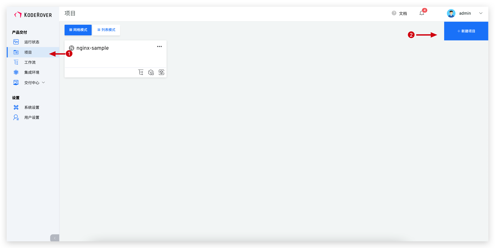
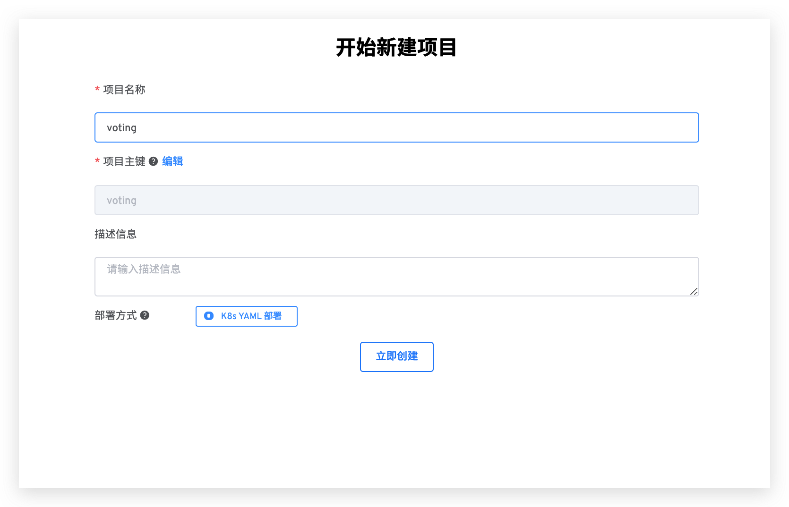


## 步骤 2：产品交付-创建服务与服务构建

这里我们需要为以下 5 个服务添加服务配置：

* vote
* worker
* result
* redis
* db

其中以下三个服务我们有代码，还需要添加构建：

* vote
* worker
* result

而redis和db直接使用标准镜像，所以不需要使用构建。

::: warning
服务配置指的是 Yaml 对这个服务的定义。Kubernetes 可以根据这个定义产生出服务实例。可以理解为 Service as Code 。
:::

Zadig 提供两种方式管理这些模板：

* 系统平台管理：在 Zadig 中直接输入 Yaml 。
* 代码仓导入与同步：从某个 Git 仓中导入，之后提交到代码仓的 Yaml 变更会自动同步到 Zadig 系统上。

::: tip
服务 Yaml 自动同步到 Zadig 系统上的功能会在配置 [Webhook](/settings/webhook-config/) 后生效
:::

这里，我们使用代码仓导入的方式。上面我们已经在代码仓的 [freestyle-k8s-specifications](https://gitlab.koderover.com/opensource/voting-app/tree/master/freestyle-k8s-specifications) 文件目录中准备好了这些 Yaml 。现在要做的就是把它们导入。

 - 加载服务配置：点击`仓库托管` 按钮 -> 选择仓库信息 -> 选择文件目录。KodeRover 支持一次性导入多个服务，选择`freestyle-k8s-specifications` 文件目录可导入 5 个服务。
 - 配置服务构建：选择服务 -> 点击`添加构建` -> 填写构建脚本


构建脚本，填写以下代码，这个服务的构建步骤是使用docker构建镜像，注意根据不同的服务修改脚本中的 `<service-directory>` 参数。

```
cd $WORKSPACE/voting-app/<service-directory>
docker build -t $IMAGE -f Dockerfile .
docker push $IMAGE
```

重复以上配置服务构建过程，完成 vote、worker 和 result 的配置。

## 步骤 3：产品交付-加入运行环境

- 点击向导的“下一步”。这时，Zadig 会根据你的配置，创建两套环境（dev，qa），以及相关工作流。

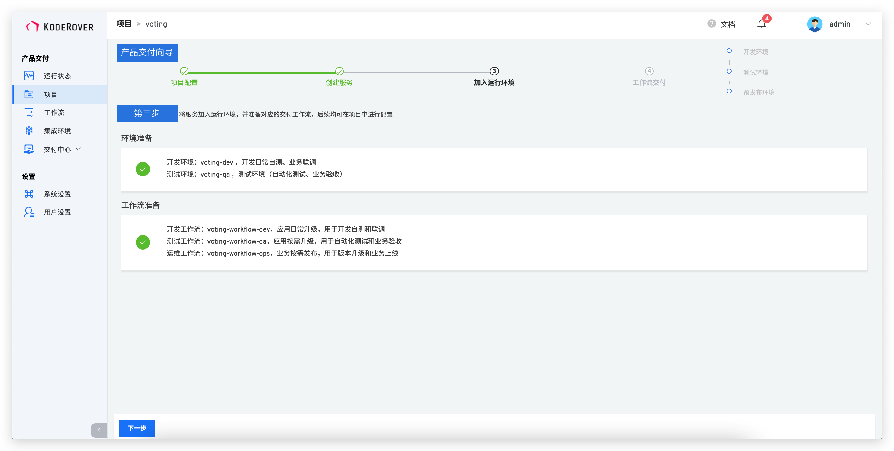

- 点击下一步完成向导。至此，onboarding 完成。一个有 5 个微服务的系统，2 套环境、3 条工作流已经产生。

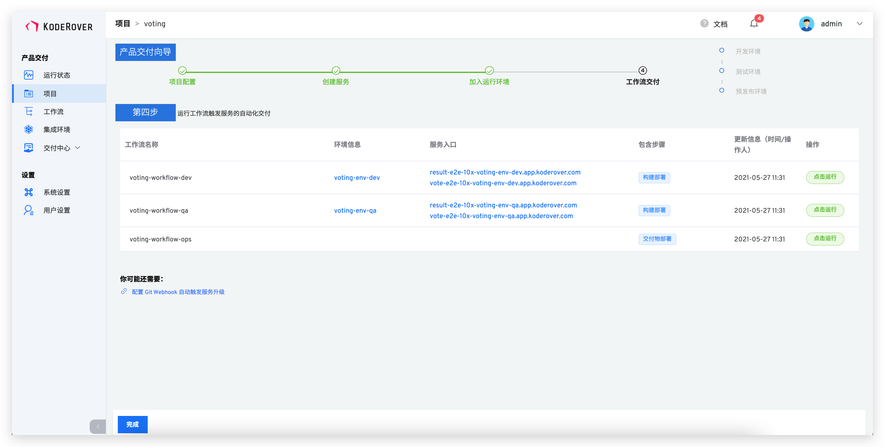

## 步骤 4：产品交付-工作流交付

- 点击“运行”，可以运行工作流。


- 选择需要更新的服务，比如 vote 和 result，点击“启动任务”运行工作流。

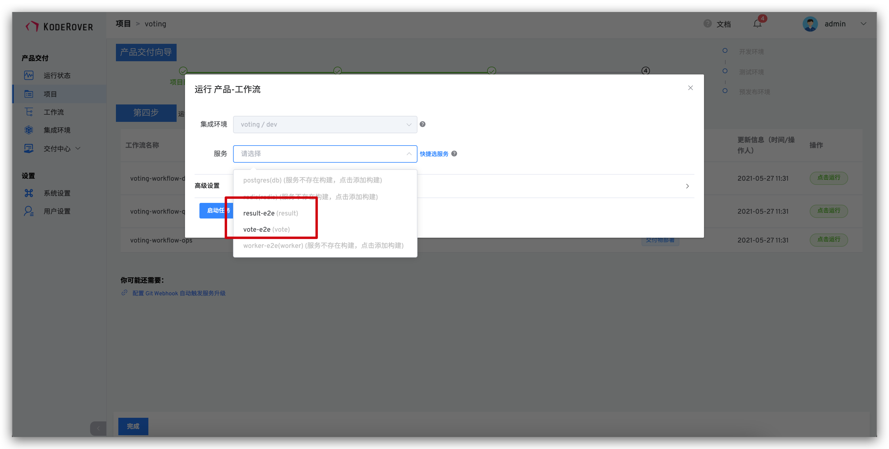

- 查看工作流运行状况：

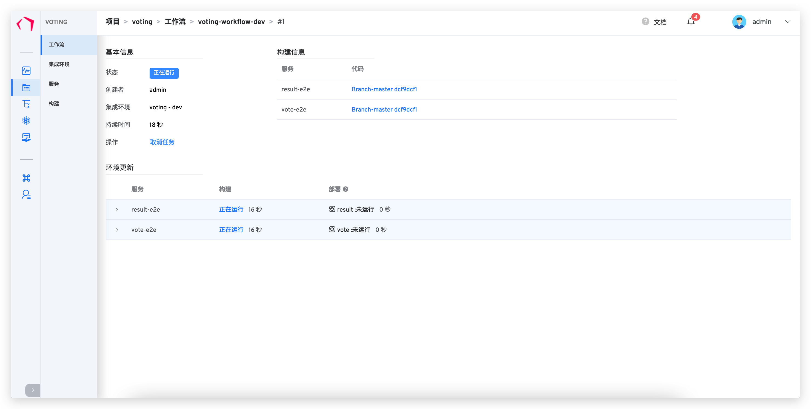

- 下面是项目的总体状态：

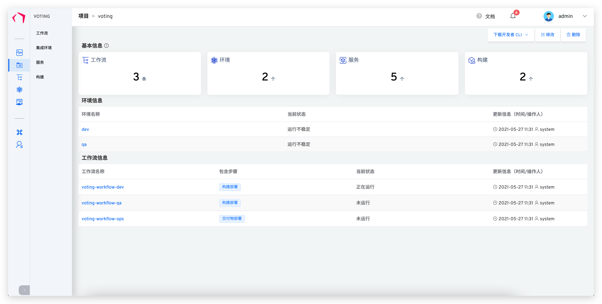

- 进入集成环境，查看服务列表并点击 result 和 vote 暴露出来的 URL 可以查看网站。

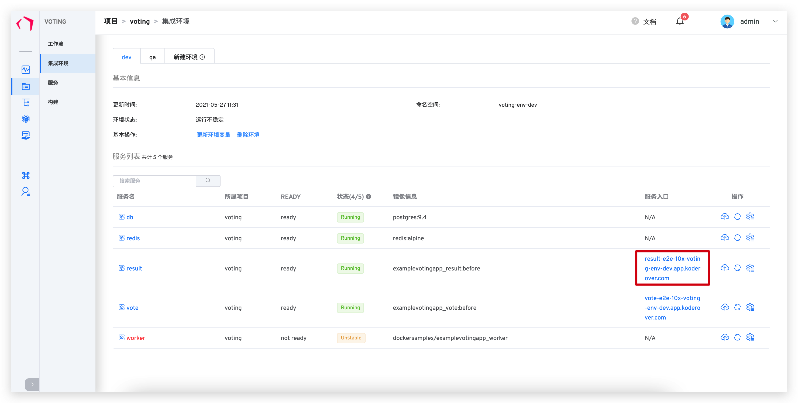
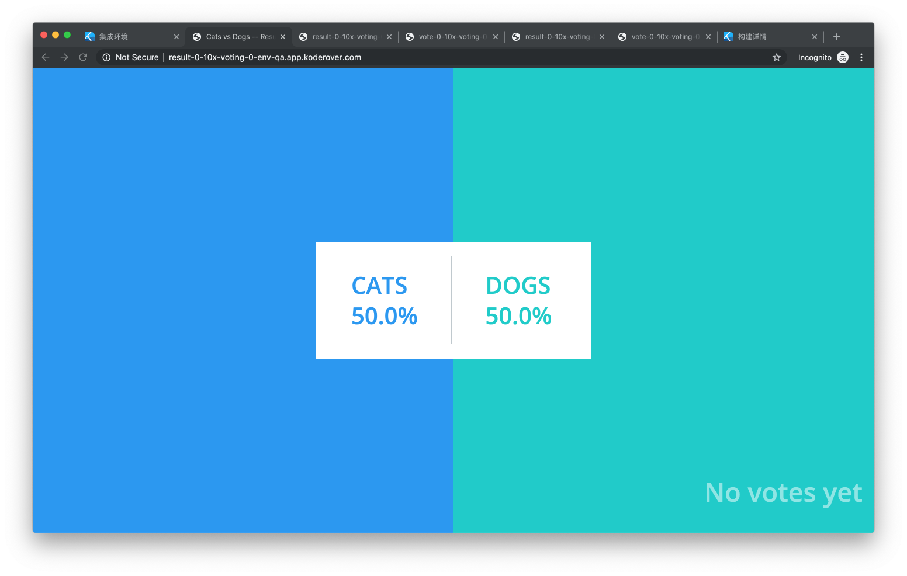
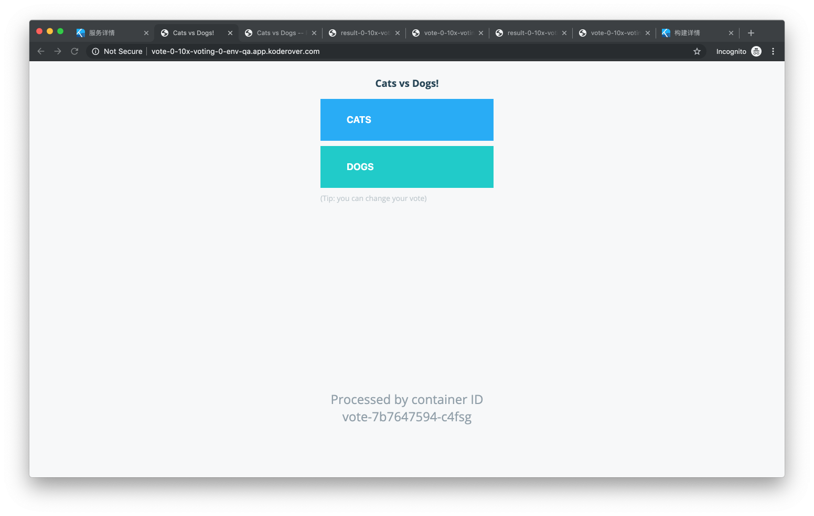

## 步骤 5：配置自动触发工作流

添加触发器，使得代码 push 或者 Pull Request 都触发 result，vote，worker 三个服务的重新构建和部署：

- 进入工作流配置页面


- 添加 Webhook 触发器


- 配置 Webhook 触发器

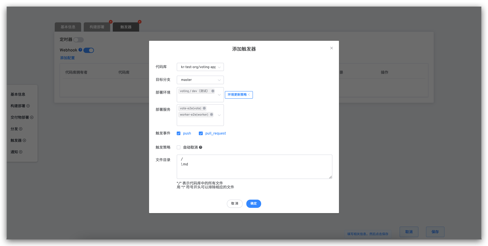

- 保存工作流


## 步骤 6：改动代码，触发工作流

我们下面对 vote 服务中 Dog 一栏的颜色做改动。

- 改动代码：

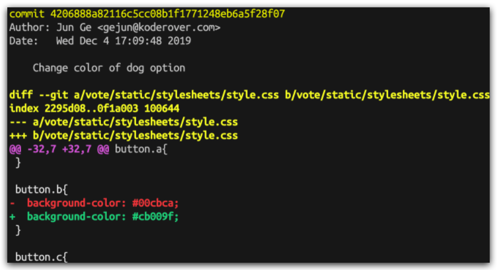

- 查看工作流运行情况

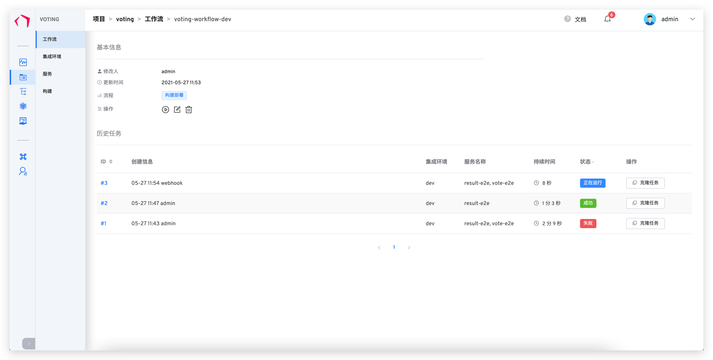


- 查看网站运行结果：


