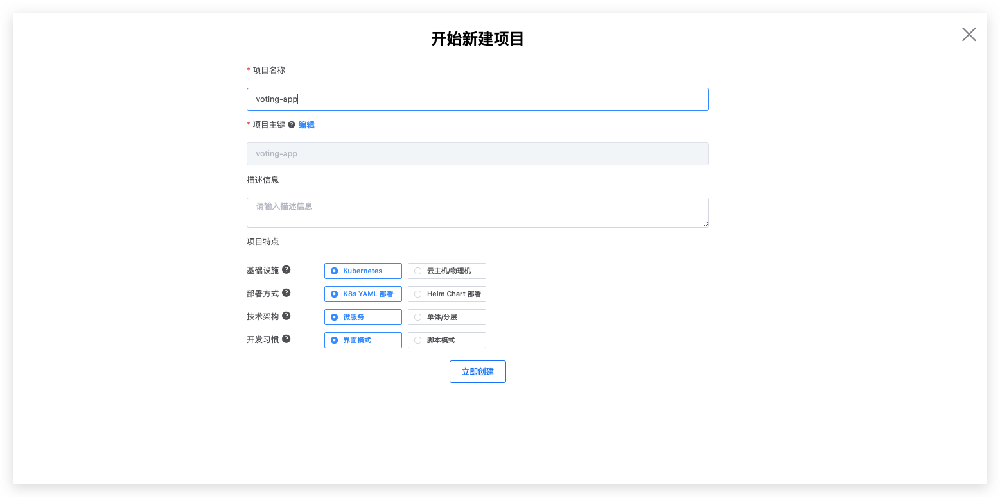
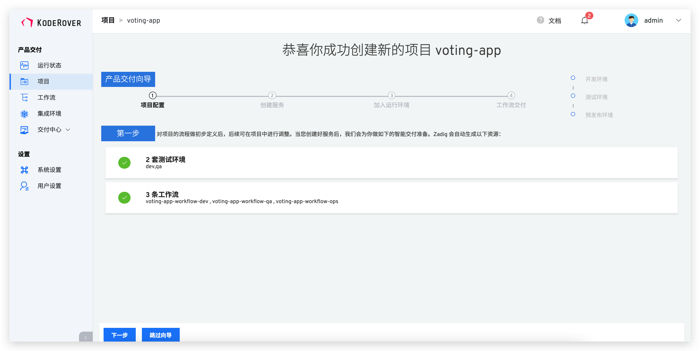
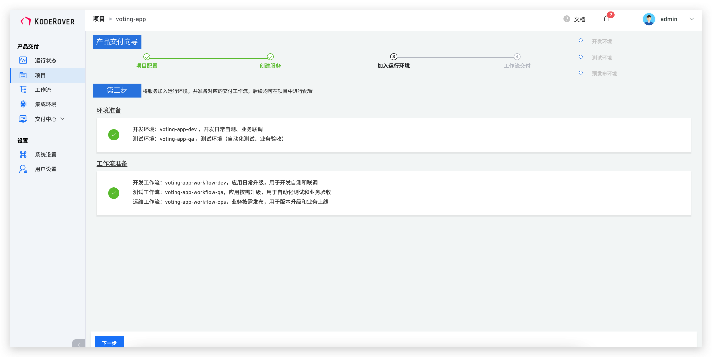
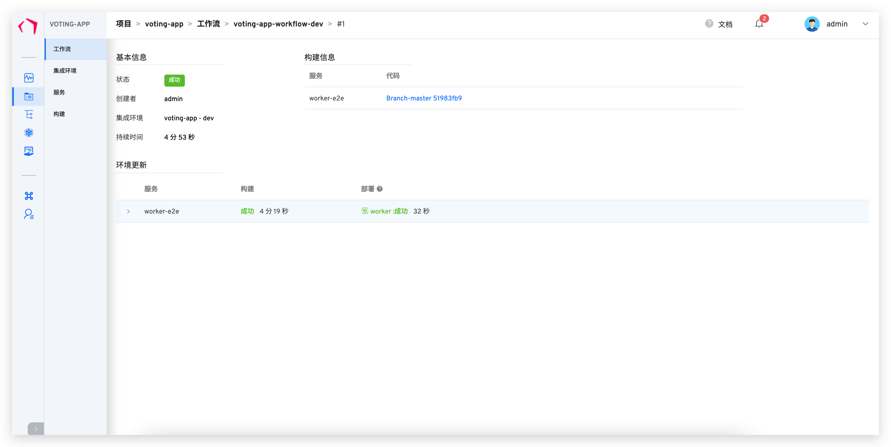
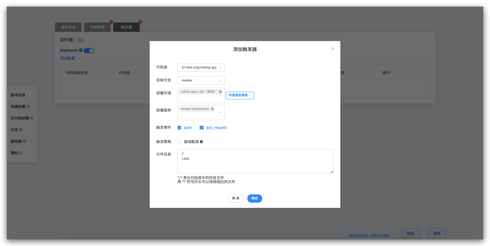
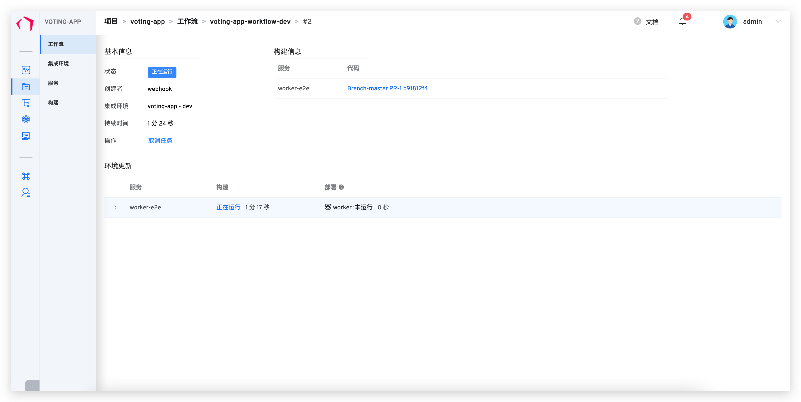
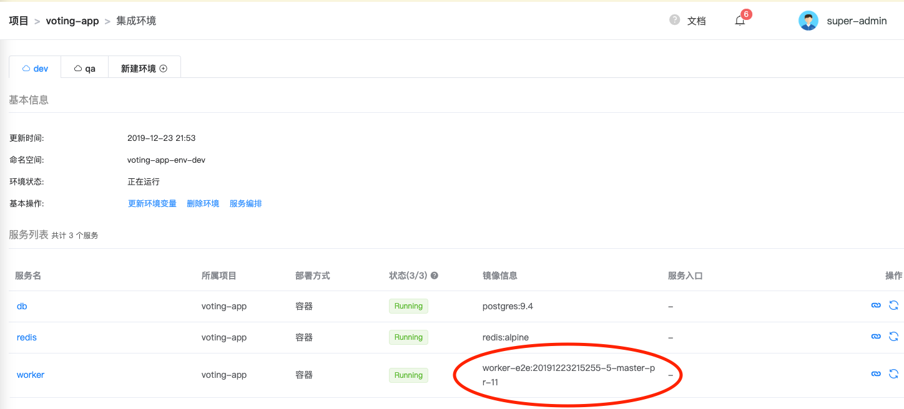

本文介绍如何在 Zadig 上快速搭建 Spring Boot 项目。Spring Boot 是构建 Java 后端应用程序的一种非常流行的框架，本文案例项目主要包含 maven 构建的 worker 、DB(postgres) 以及 Redis 这三个服务，以下步骤包含从 Code 到 Ship 的整个过程的演示

## 准备工作

- 项目案例源码： [`https://github.com/koderover/Zadig/tree/master/examples/voting-app/worker`](https://github.com/koderover/Zadig/tree/master/examples/voting-app/worker) 也可配置自己的私有仓库使用 [GitHub 集成](/settings/codehost/github)
- 服务 Yaml 文件：[`https://github.com/koderover/Zadig/tree/master/examples/voting-app/freestyle-k8s-specifications/worker`](https://github.com/koderover/Zadig/tree/master/examples/voting-app/freestyle-k8s-specifications/worker)
- 服务 Dockerfile 文件：[`https://github.com/koderover/Zadig/blob/master/examples/voting-app/worker/Dockerfile.j`](https://github.com/koderover/Zadig/blob/master/examples/voting-app/worker/Dockerfile.j)
- 配置 GitHub 的 Webhook，本案例以项目级的 WebHook 为例，全局 Webhook 请参考 [GitHub Webhook 配置](/settings/webhook-config/#github-webhook-配置)

## 步骤 1：产品交付-项目配置

- 创建项目，具体内容如下图所示：



- 接下来会看到创建成功的提示：


## 步骤 2：产品交付-创建服务

- 创建服务，如下图所示：


::: tip
创建服务有两种方式，第一种是选择平台编辑直接把 Yaml 内容粘到系统中，第二种是选择从仓库导入 Yaml 文件，示例中采用第二种。
:::

- 点击仓库托管，在弹出的窗口中选择代码仓库和 worker 服务 Yaml 所在文件目录，点击加载。
- 系统会自动检测 Yaml 格式是否合法，右侧会自动解析出来系统变量、自定义变量和服务组件，这里也可以继续添加自定义变量。具体过程如下图所示：


- 创建构建，这里可以选择 worker-e2e 这个服务组件添加构建，然后选择代码库和添加构建脚本，具体如下图所示：


构建脚本如下：

```dockerfile
cd $WORKSPACE/voting-app/worker
docker build -t $IMAGE -f Dockerfile.j .
docker push $IMAGE
```
添加完成后，点击`保存构建`。

- 点击仓库托管，继续添加 DB  (postgres) 和 Redis 服务，如下图所示。


::: tip
1. 实际场景中已存在现有可用的中间件服务，在网络联通情况下可以直接使用
2. 若同一中间件服务针对不同环境需要使用不同的服务地址，可以通过设置环境变量的方式配置
:::

- 添加成功后，点击下一步，完成服务配置。

## 步骤 3：产品交付-加入运行环境

- 进入「加入运行环境」，系统会自动创建两套环境和三条工作流，两套集成环境分别给开发和测试使用，三条工作流也会自动绑定对应的开发环境以达到持续交付的目的。具体如下图所示：



## 步骤 4：产品交付-工作流交付

- 点击运行第一条工作流，来完成 dev 环境的持续交付，点击执行任务




- qa 环境的持续交付类似的操作，不赘述。

到此，您已熟悉 Zadig 的基本功能了，下面将展示如何配置自动触发工作流和版本交付。

## 步骤 5：配置自动触发工作流

- 创建触发器，修改 dev 工作流添加触发器，系统目前支持 push 和 pull_request 两种事件，具体如下图所示：

> 前提条件：需要配置 GitHub Webhook，本案例以项目级的 WebHook 为例，全局 Webhook 请参考 [GitHub Webhook](/pages/09351a)



- 在 GitHub 中提交 PR，本文以更新 dev 测试环境为例，在 check run 中会展示具体的系统工作流的状态，具体如下图所示：


- 点击任务链接可以链接到系统里面查看具体信息，具体如下图所示：



- 最后可以看到环境里面的镜像已经被更新了，具体如下图所示：



