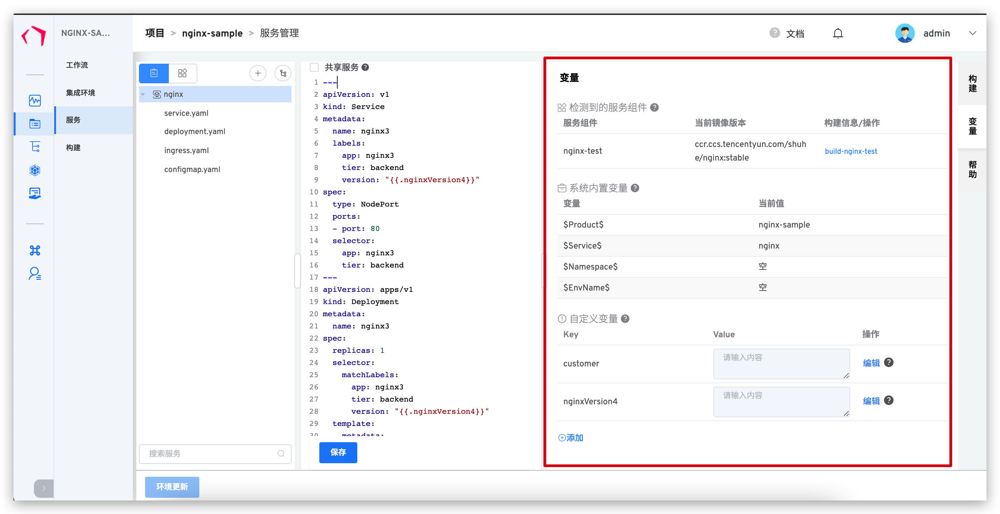
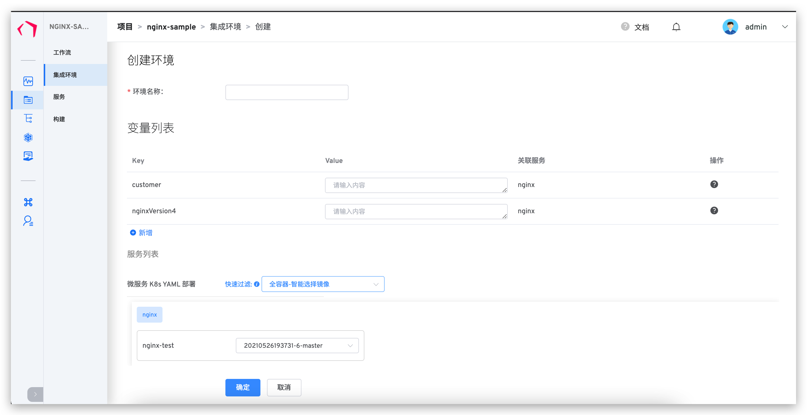
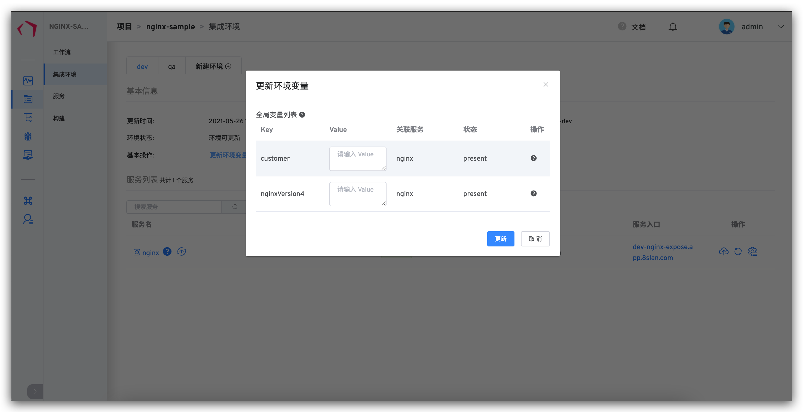

本文主要介绍 Zadig 变量的定义和使用。
## 变量的定义

> 变量主要分为系统内置变量和自定义变量，均可在服务 YAML 中进行引用。



添加服务或者更新服务时可创建或更新变量

### 系统内置变量
包括 `$Namespace$`、`$Product$`、`$Service$`、`$EnvName$` ，可直接在 YAML 中进行引用，具体说明如下：

  - `$Namespace$`：项目创建的集成环境所在的 k8s 空间名称
  - `$Product$`：项目名称
  - `$Service$`：服务名称
  - `$EnvName$`：创建的集成环境名称
### 自定义变量

通过平台新增 `Key`，可输入默认 `Value`，通过关键字：<span v-pre>`{{.key}}`</span> 引用

例如：在 K8s YAML 中引用配置的变量 

```yaml
apiVersion: extensions/v1beta1
kind: Ingress
metadata:
  name: $Product$-index  //引用系统内置变量 $Product$，环境创建时被渲染
spec:
  rules:
  - host: {{.portal_host}} //引用自定义变量 portal_host，环境创建时被渲染
    http:
      paths:
      - backend:
          serviceName: $Product$-index
          servicePort: 80
        path: /
```

### 变量的使用

#### 创建集成环境时使用

在集成环境创建时，对项目中所有服务的 YAML 和服务配置文件进行渲染。



#### 环境变量更新时使用

在集成环境中，对于正常运行中的服务，可以自行更新变量值，基本操作中点击`更新环境变量`，即可更新对应集成环境中的环境变量。


  


