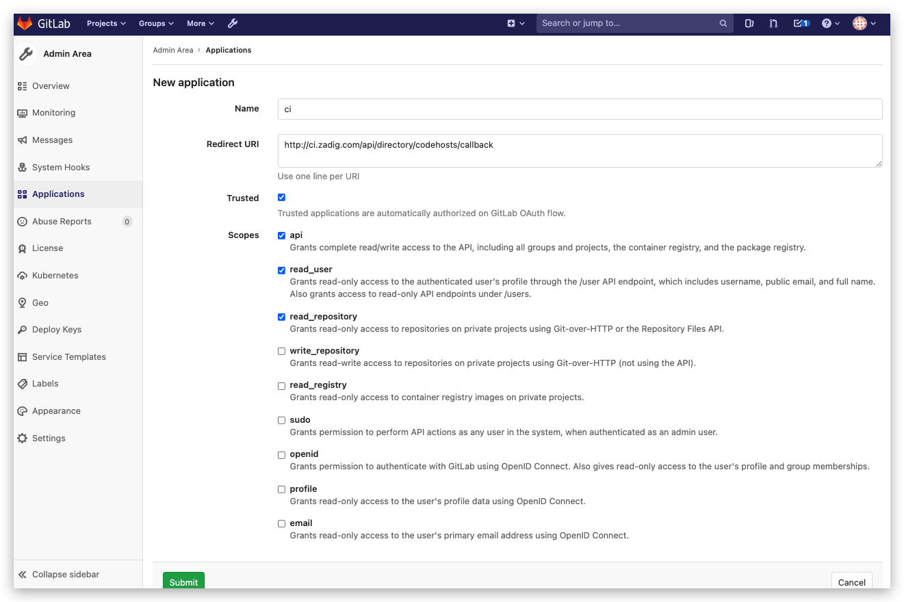
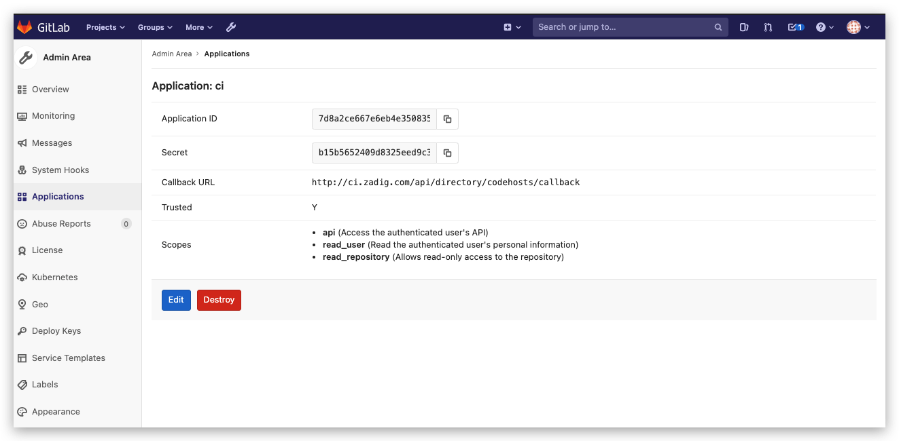
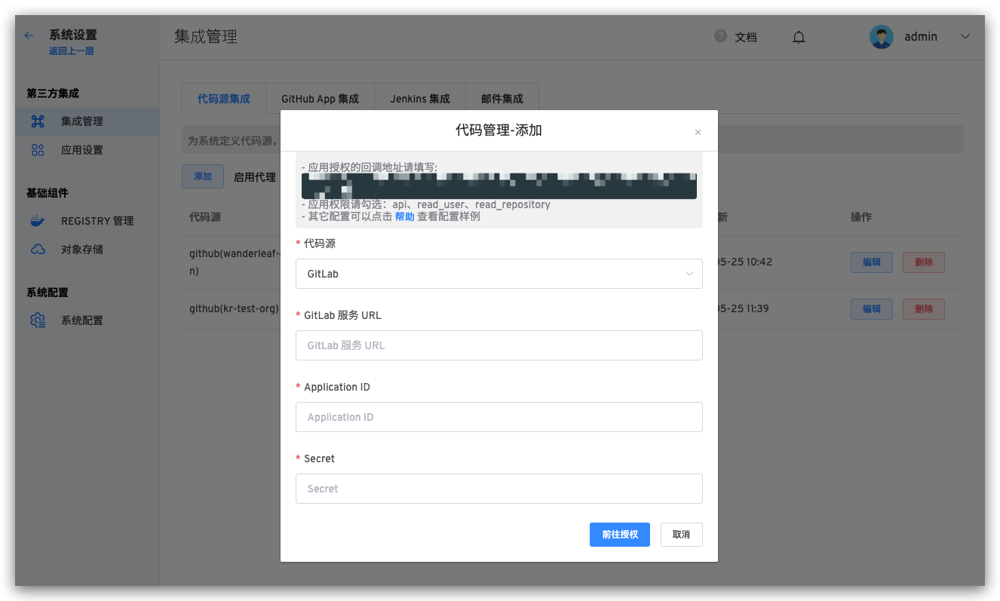
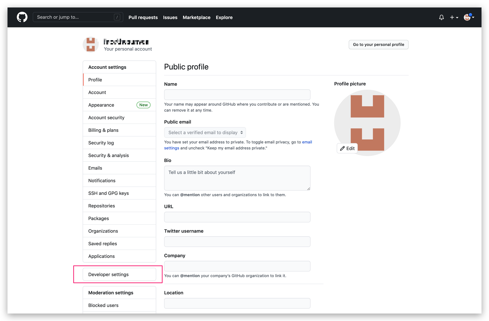
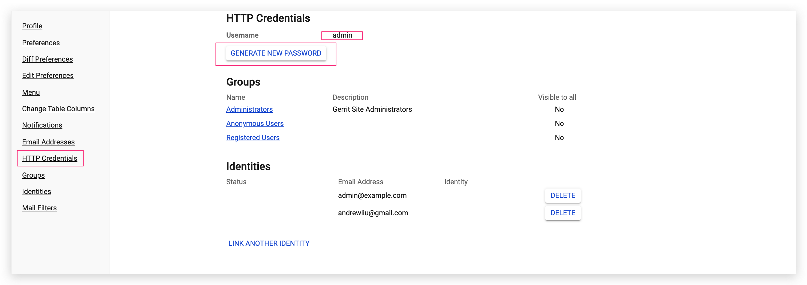
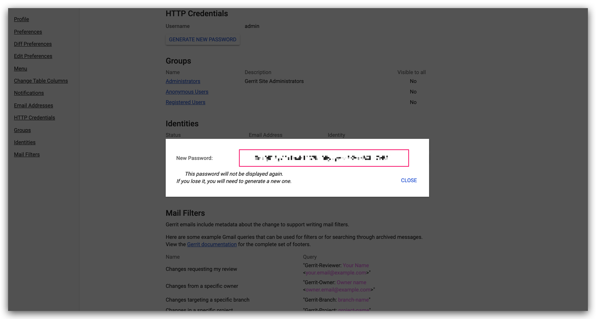

本文介绍如何在 Zadig 系统上集成代码管理平台。目前系统支持的代码管理平台有：公有和私有的 [GitLab](#gitlab) 、[GitHub](#github) 以及 [Gerrit](#gerrit) 。

## GitLab 集成

> 目前系统采用 OAuth2 的方式与 GitLab 进行代码的授权认证

如需集成 GitLab，可以按照以下流程配置：

- GitLab 管理员新建 OAuth 应用程序
- 配置 OAuth 应用程序，填写基本信息以及回调地址
- 获取 OAuth 应用程序的 `Application ID`、`Secret` 信息
- 配置 GitLab 集成，将获取到的 `Application ID`、`Secret` 信息填写到 Zadig 系统
- 跳转到 GitLab 进行认证授权

### 步骤 1：新建 GitLab OAuth 应用程序

> `要启用 GitLab OAuth2，你必须在 GitLab 中注册一个应用程序。`

GitLab 管理者可以通过 `Admin Area` > `Applications` 来新建应用程序。

### 步骤 2：配置 GitLab OAuth 应用程序

在新建应用程序页面，你需要进行如下步骤

- 1. 填写应用的名称
- 2. 回调地址请填写 `http://[zadig.yours.com]/api/directory/codehosts/callback`
- 3. 赋予权限 `api` 、`read_user` 、`read_repository`
- 4. 点击创建

:::tip 注意
回调地址中 `zadig.yours.com` 需要替换为 Zadig 系统部署的实际地址
:::

### 步骤 3：获取 Application ID、Secret 信息

应用创建成功后，GitLab 会返回应用的相关信息，其中包括 `Application ID` 、`Secret` 信息。

### 步骤 4：将 Application ID、Secret 集成到系统

切换到 Zadig 系统，管理员依次点击 `系统设置` -> `集成管理` -> `代码源集成` -> 点击添加按钮。

依次填入如下已知信息：

- `代码源`：此处选择 GitLab
- `GitLab 服务 URL`：GitLab 地址
- `Application ID`：步骤 3 应用创建成功后返回的 Application ID
- `Secret`：步骤 3 应用创建成功后返回的 Secret

信息确认无误后点击 `前往授权`，耐心等待，此时会系统会跳转到 GitLab 进行授权。

点击授权按钮，同意授权后，GitLab 会跳转到 Zadig 系统，至此 GitLab 集成完毕。

## GitHub 集成

> 目前系统采用 OAuth2 的方式与 GitHub 进行代码的授权认证

如需集成 GitHub，可以按照以下流程配置：

- GitHub Organization 管理员新建 OAuth 应用程序
- 配置 OAuth 应用程序，填写基本信息以及回调地址
- 获取 OAuth 应用程序的 `Client ID`、`Client Secret` 信息
- 配置 GitHub 集成，将获取到的 `Client ID`、`Client Secret` 信息填写到 KodeRover系统
- 跳转到 GitHub 进行认证授权

### 步骤 1：新建 GitHub OAuth 应用程序

> `要启用 GitHub OAuth2，你必须在 GitHub 中注册一个应用程序。`

1. 个人账号下的代码库接入： 可以通过点击用户名 -> Settings -> Developer settings -> OAuth Apps 来新建应用程序。
2. GitHub Organization 下的代码仓库接入： 可以通过点击 Organization Settings -> Developer settings -> OAuth Apps 来新建应用程序。

下面以 GitHub Organization 为例，如下所示。

- 打开 `Organization Settings`。

- 选择 `Developer settings` -> `OAuth Apps`，点击 `New OAuth App` 新建应用程序。

### 步骤 2：配置 GitHub OAuth 应用程序

在新建应用程序页面，你需要进行如下步骤：

- 1. Application name：zadig，也可以填写可识别的任一名称。
- 2. Homepage URL：http://[koderover.yours.com]
- 3. Authorization CallBack URL： `http://[koderover.yours.com]/api/directory/codehosts/callback`
- 4. 点击创建

:::tip 注意
回调地址中 `koderover.yours.com` 需要替换为 Zadig 系统部署的实际地址
:::

### 步骤 3：获取 Client ID、Client Secret 信息

应用创建成功后，GitHub 会返回应用的基本信息，点击 `Generate a new client secret` 生成 `Client Secret`。

此时页面包括完整的 `Client ID` 、`Client Secret`。

### 步骤 4：将 Client ID、Client Secret 集成到系统

切换到 Zadig 系统，管理员依次点击`系统设置` -> `集成管理` -> `代码源集成` -> 点击添加按钮。

依次填入如下已知信息：

- `代码源`：此处选择 GitHub
- `Client ID`：步骤 3 应用创建成功返回的 Client ID
- `Client Secret`：步骤 3 生成的 Client Secret
- `Organization`：GitHub 要授权的 Organization 名称

信息确认无误后点击 `前往授权`，耐心等待，此时会系统会跳转到 GitHub 进行授权。

点击授权按钮，同意授权后，GitHub 会跳转到 Zadig 系统，至此 GitHub 集成完毕。

## Gerrit 集成

> 目前系统采用 Basic Auth 的方式从 Gerrit 获取代码以及调用 Gerrit 的 API

如需配置 Gerrit 支持，可以按照以下流程配置：

- 登录 Gerrit（建议使用专用账号）, 进入设置页面，获取用户名和密码
- 在 Zadig 配置页面输入 Gerrit 地址、用户名和密码，保存完成

### 步骤 1：获取 Gerrit 的用户名和密码

Gerrit 管理员可以通过点击 Gerrit 右上角的 `Settings` 按钮，进入设置页面。找到 HTTP 密码 `HTTP Credentials` 配置区域，点击
生成新密码 `GENERATE NEW PASSWORD`，并复制新生成的密码。

### 步骤 2：将配置填入 Zadig

切换到 Zadig 系统，管理员依次点击 `系统设置` -> `集成管理` -> `代码源集成` -> 点击添加按钮。

依次填入如下已知信息：

- `代码源`：此处选择 Gerrit
- `Gerrit 服务 URL`： Gerrit 地址，比如 https://gerrit.example.com
- `用户名`：Gerrit 用户名
- `密码`： 上一个步骤中复制的密码

信息确认无误后点击 `确定`，至此 Gerrit 集成完毕。